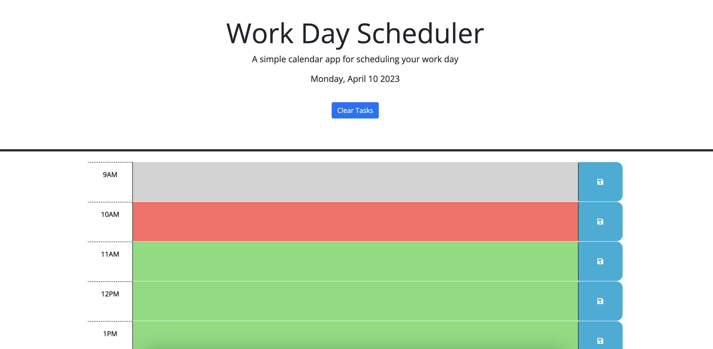

# Work Day Scheduler

## Description

Work Day Scheduler project helps you stay orginize with the time slot. The JavaScript file was created using Day.js and jQuery libraries  The time slots colors will be different depend on past(gray), present (red), and future (green).

You can access the page at [this location](https://sonjdaniel.github.io/Work-Day-Scheduler/).

## Installation

N/A

## Usage
To add a new task, do the following:
* Click on the text area
* description of your task;
* Click on the save button
* Note that you can clear all task.

## Credits

With the help of instruction and guidance of the staff of the UofM coding boot camp, nor without the resources at W3 and the Mozilla Developers Network. I was able to write the code the best I can.

In building this site I was using the jQuery Javascript library, the Day.js javascript library and Bootstrap dev framework.

## License
N/A

